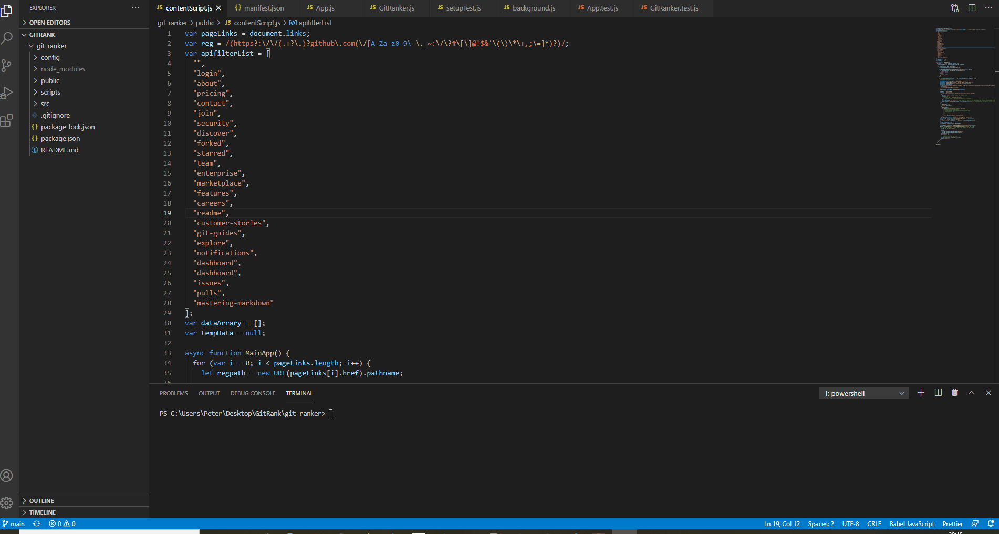
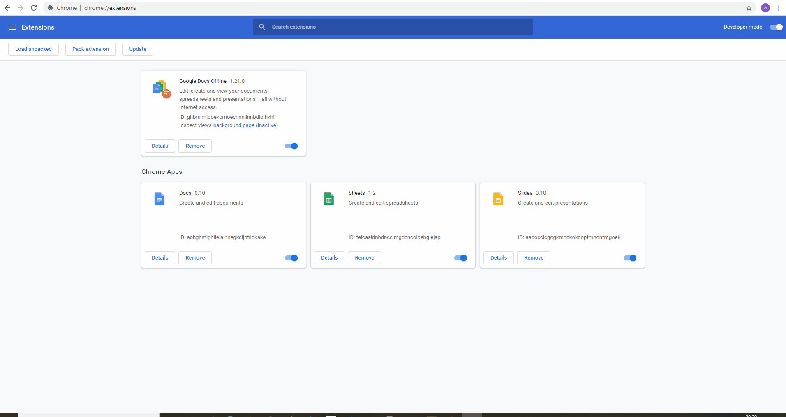

# Getting Started with Git Ranker Browser Extension

This Chrome Extension developed using React framework scrapes github links associated to a browser window and attaches a popup extension to get the rank of the associated Git profile. 

The project has been tested and implemented mainly on Google Chrome browser.

## Installation

Assuming that the project is already pulled into the target local repository, the installation steps would continue as follows:

### 1. Build the project

Using `npm run build` command in the target directory build the project.

### `npm run build`

Running the build command exposed the build folder which is directory containing the static build files required to run a deployed React application.

Since the chrome extension apps differ from the generic web applications, we cannot follow the generic approach of hosting a server in the localhost. The main reason would be because extensions are fundamentally expected to deploy on websites over cross domain server.

To address this issue, in this case, we are using the static files of the build folder as reference for the chrome extension application. Specifically the files  `./build/index.html`, `./build/contentScript.js` and `./build/manifest.json`, which are key components in iFrame window of extension application. The three files represent the presentation, server and configuration layers of the extension apllication.

### 2. Loading the Extension into the Browser

With the Chrome Web Broswer or any other web browser that supports extensions open, navigate to the extensions menu/tab. 
### Note: Make sure developer mode is enabled in the browser.

With the developer mode enabled one can find the `Load Unpacked` button, which opens a file explorer window. We just need to point the build folder exposed in the initial step as the selected folder. The extension should now be ready and loaded into the browser.

### 3. Testing the Application

Enzyme integration testing framework is used to write tests for the React components of application. Application contains a main App.js component and a child GitRanker.js component.

The command `npm run test` can be used to run the predefined tests written in `App.test.js` and `GitRanker.test.js`.

### `npm run test`

### 4. Working with Changes and Development

With the GitRanker repository loaded into the IDE workspace, changes to the Chrome extension application can be made similar to the native React applications by modifying the `./src` folder.

The chrome extension does not support one hot reloading to dynamically update the changes to the application. Hence, whenever the changes are made make sure to re-build the application using `npm run build` and reload the extension manually in the browser to see the changes.

